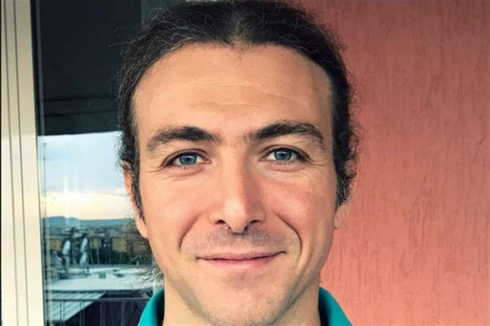
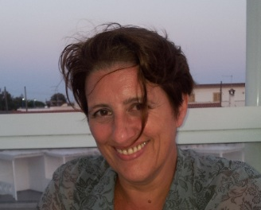
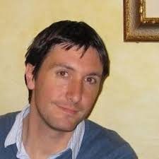
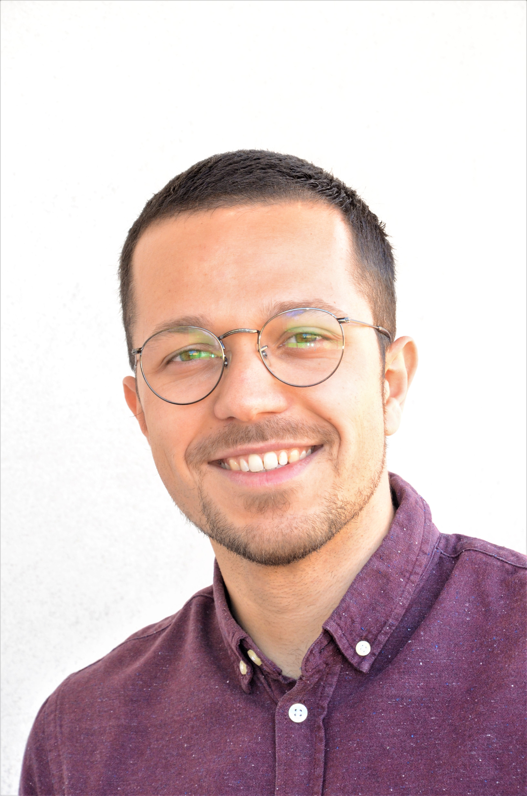

***
# Who we are

 

StatGroup-19 is a scientific research group spontaneously born out of the desire to study and analyze the worldwide spreading outbreak of the CoviD-19 syndrome, due to the SARS-CoV-2 virus. In particular, the group, being Italy-based, focuses on the Italian outbreak. Our activity is developed with collaborative intentions,  we are open to criticism and suggestions, and to scientific interactions with other research groups.

<b>Blog: </b> https://statgroup-19.blogspot.com/
 
<b>Facebook: </b> https://www.facebook.com/StatGroup-19-100907671547894/
 
<b>Italian version of the app: </b> https://statgroup19.shinyapps.io/Covid19App/
***

# Team

 

<table float="center" width="100%" border="0">
  <tr>    
  <td></td>
  <td></td>
  <td></td>
  <td></td>
  <td></td>
  </tr>
</table>

 

<h4>Contacts (from the left to the right)</h4>
<ul>
  <li><b>Fabio Divino</b>, University of Molise (fabio.divino@unimol.it)</li>
  <li><b>Alessio Farcomeni</b>, University of Roma - Tor Vergata (alessio.farcomeni@uniroma2.it)</li>
  <li><b>Giovanna Jona Lasinio</b>, University of Roma - La Sapienza (giovanna.jonalasinio@uniroma1.it)</li>
  <li><b>Gianfranco Lovison</b>, University of Palermo (gianfranco.lovison@unipa.it)</li>
  <li><b>Antonello Maruotti</b>, LUMSA University (a.maruotti@lumsa.it)</li>
</ul> 

***

# Assistants

<table float="center" width="25%" border="0">
  <tr>    
  <td></td>
  <td></td>
  </tr>
</table>

 

StatGroup-19 team collaborates with (from the left to the right):
<ul>
  <li><b>Piefrancesco Alaimo Di Loro</b> (pierfrancesco.alaimodiloro@uniroma1.it), Ph.D. student at the Statistical Department of University of Rome - La Sapienza, to develop the methodology and for the implementation of the models</li>
  <li><b>Marco Mingione</b> (marco.mingione@uniroma1.it), Ph.D. student at the Statistical Department of University of Rome - La Sapienza, to develop the  methodology and for the building and maintenance of the ShinyApp.</li></ul>

***

## Sources

This web application is updated every time that a user connects to it. 
Data is available from the 24th of February 2020 and updated to the latest version available at the Github repository of italian Protezione Civile,  [here](https://github.com/pcm-dpc/COVID-19). 
The methodology and the implementation is fully developed by StatGroup19 and its assistants. 

***

## How is it done

The web application is fully developed using the R statistical environment and the package [Shiny](https://rstudio.com/products/shiny/) and it is hosted on the free platform [ShinyApps](https://www.shinyapps.io/). All the codes for generating the app are available at the following [link](https://github.com/minmar94/StatGroup19).

 