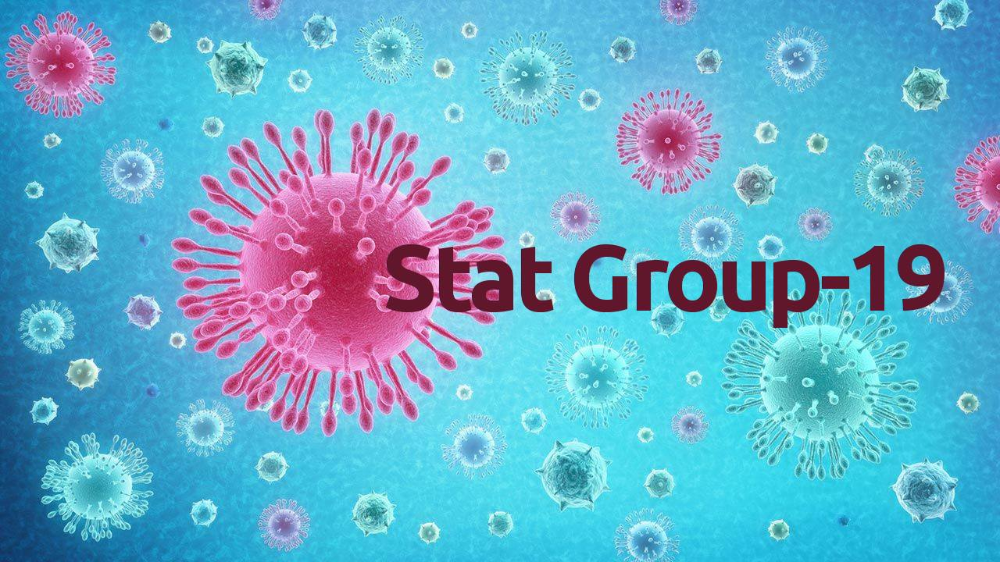

# CoviData19 - an app for all 
Our work is intended to give people an easy tool for accessing information about the Italian COVID-19 epidemic in an interactive and transparent way. The web application we built is automatically updated every day after the Italian Protezione Civile report (Data Source) and shows both descriptive and modeling analysis, giving the user the possibility to customize several choices.

## StatGroup-19
StatGroup-19 is a scientific research group spontaneously born out of the desire to study and analyze the worldwide spreading outbreak of the CoviD-19 syndrome, due to the SARS-CoV-2 virus. In particular, the group, being Italy-based, focuses on the Italian outbreak. 

Since the increase of attention and concern in the public opinion, Fabio Divino (University of Molise), Alessio Farcomeni (Tor Vergata University of Rome), Giovanna Jona Lasinio (University of Rome La Sapienza), Gianfranco Lovison (University of Palermo) and Antonello Maruotti (LUMSA University, Rome) decided to make their skills available to the scientific community to contribute to the understanding of the phenomenon. The fundamental aim of the group is to offer useful information to decision-makers and citizens in this complex moment.

StatGroup-19 collaborates with Pierfrancesco Alaimo di Loro and Marco Mingione, both Ph.D. students at the Department of Statistical Science of the University of Rome "La Sapienza".

Our activity is developed with a collaborative intentions,  we are open to criticism and suggestions, and to scientific interactions with other research groups.

